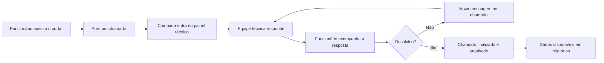
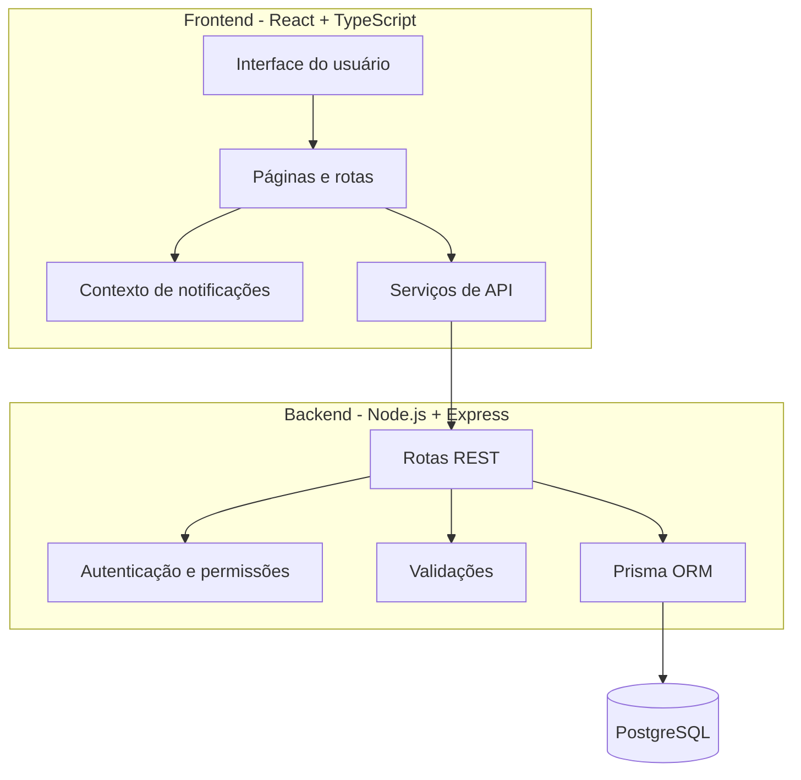

<div align="center">

# PTL - Lifting Support

### Sistema interno de chamados e suporte técnico desenvolvido para a Lifting


**Projeto exclusivo da Lifting, apresentado aqui como case de portfólio.**

</div>

---

## Visão Geral

O **PTL** é uma plataforma interna criada para organizar o suporte técnico da Lifting. A proposta foi transformar solicitações dispersas em um fluxo claro, rastreável e fácil de acompanhar.

O sistema centraliza a abertura de chamados, o atendimento técnico, o histórico de mensagens, os status de cada solicitação e os relatórios usados pela gestão.

> Este repositório não tem foco em distribuição pública, instalação por terceiros ou uso externo.  
> O objetivo aqui é apresentar a solução, as decisões técnicas e o tipo de problema resolvido.

---

## Problema Resolvido

Antes de um sistema dedicado, chamados internos podem facilmente se perder entre conversas, mensagens soltas e controles manuais. Isso dificulta saber:

- quais solicitações estão abertas;
- quem está aguardando resposta;
- quais setores mais demandam suporte;
- qual foi o histórico de atendimento;
- quais chamados já foram resolvidos;
- como transformar a operação em dados para gestão.

O PTL foi criado para trazer **clareza, rastreabilidade e velocidade** para esse processo.

---

## Ambientes Do Sistema

| Área | Público | Objetivo |
| --- | --- | --- |
| **Painel Técnico** | Admin, TI e Diretoria | Acompanhar chamados, indicadores, relatórios e cadastros |
| **Portal do Funcionário** | Colaboradores internos | Abrir chamados, acompanhar respostas e finalizar atendimentos |

---

## Funcionalidades

| Módulo | Recursos |
| --- | --- |
| **Chamados** | Abertura, listagem, resposta técnica, mensagens, alteração de status e finalização |
| **Dashboard** | Indicadores por status, setor, categoria e origem |
| **Relatórios** | Filtros por busca, setor, categoria, origem, status e período |
| **Exportação** | Geração de relatórios em PDF e Excel |
| **Administração** | Cadastro e manutenção de setores e funcionários |
| **Permissões** | Separação de acesso entre portal do funcionário e perfis técnicos |
| **Histórico** | Registro de mensagens e eventos relevantes do chamado |

---

## Fluxo Principal



---

## Arquitetura



---

## Stack Técnica

### Frontend

| Tecnologia | Uso |
| --- | --- |
| **React** | Construção da interface |
| **TypeScript** | Tipagem e manutenção do código |
| **Vite** | Ambiente de desenvolvimento e build |
| **Tailwind CSS** | Estilização |
| **shadcn/radix** | Componentes de UI |
| **Recharts** | Gráficos do dashboard |
| **jsPDF** | Exportação em PDF |
| **XLSX** | Exportação em Excel |

### Backend

| Tecnologia | Uso |
| --- | --- |
| **Node.js** | Runtime da API |
| **Express** | Rotas e camada HTTP |
| **Prisma** | ORM e acesso ao banco |
| **PostgreSQL** | Banco de dados relacional |
| **JWT/HMAC** | Assinatura e validação de tokens |

---

## Estrutura Do Projeto

```text
.
|-- backend
|   |-- prisma
|   |   |-- schema.prisma
|   |   |-- migrations
|   |   `-- seed.ts
|   `-- src
|       |-- lib
|       |-- middlewares
|       |-- routes
|       `-- server.ts
|
|-- frontend
|   |-- public
|   `-- src
|       |-- components
|       |-- contexts
|       |-- lib
|       |-- pages
|       `-- services
|
`-- README.md
```

---

## Principais Telas

| Tela | Descrição |
| --- | --- |
| **Login Técnico** | Acesso restrito para perfis autorizados |
| **Dashboard** | Visão geral da operação e indicadores |
| **Chamados** | Atendimento, respostas, status e arquivamento |
| **Relatórios** | Filtros, métricas e exportação de dados |
| **Configurações** | Gestão de setores e funcionários |
| **Portal do Funcionário** | Abertura e acompanhamento de chamados |

---

## Regras De Negócio

- Funcionários acessam apenas os próprios chamados.
- Perfis técnicos têm permissões diferentes conforme o nível de acesso.
- Chamados finalizados são arquivados, mas continuam disponíveis para consulta.
- Setores e funcionários podem ser desativados sem apagar o histórico.
- Mensagens e mudanças de status ficam registradas para rastreabilidade.
- Relatórios consideram chamados ativos e arquivados quando necessário.

---

## Minha Atuação

Neste projeto, atuei no desenho e desenvolvimento de uma solução completa, conectando interface, API, banco de dados e regras de negócio.

O foco foi construir algo prático para o dia a dia da operação:

- fluxo simples para abertura de chamados;
- painel técnico direto e funcional;
- dados úteis para acompanhamento da gestão;
- separação clara de permissões;
- preservação de histórico;
- interface responsiva e organizada;
- backend estruturado para sustentar os principais fluxos.

---

## O Que Este Projeto Demonstra

O PTL mostra a construção de um sistema com fluxo completo, indo além de uma interface estática:

| Competência | Aplicação no projeto |
| --- | --- |
| **Frontend** | Telas responsivas, dashboard, formulários e experiência de uso |
| **Backend** | API REST, autenticação, permissões e validações |
| **Banco de dados** | Modelagem com setores, funcionários, chamados, mensagens e timeline |
| **Produto** | Solução pensada para uma dor real de operação |
| **Relatórios** | Filtros, indicadores e exportação de dados |
| **Manutenção** | Organização em módulos, serviços e componentes reutilizáveis |

---

## Nota De Portfólio

Este é um projeto exclusivo para a realidade interna da **Lifting**. Por isso, o README não inclui instruções de instalação, credenciais, variáveis de ambiente ou passos para execução pública.

A intenção é apresentar o raciocínio, a solução desenvolvida e a capacidade técnica aplicada em um sistema real.

---

<div align="center">

**PTL - registrar melhor, responder mais rápido e não deixar chamado se perder.**

</div>
